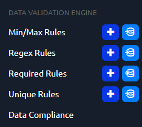
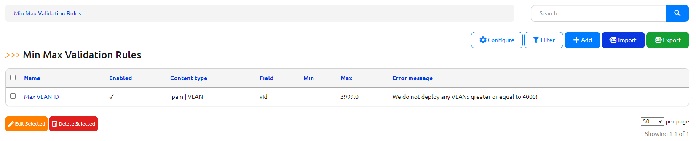
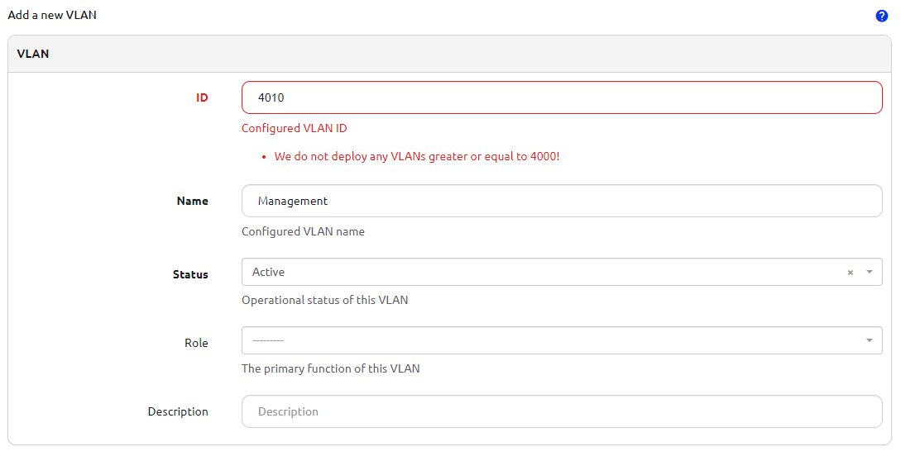

# Nautobot Data Validation Engine Plugin

A plugin for [Nautobot](https://github.com/nautobot/nautobot) with a UI to build custom data validation rules for Source of Truth data.

## Usage

The data validation engine plugin offers a set of user definable rules which are used to enforce business constraints on the data in Nautobot. These rules are tied to particular models and each rule is meant to enforce one aspect of a business use case. There are currently two supported rule types, regular expressions, and min/max numeric rules.



### Regular Expression Rules


Each rule is defined with these fields:

* name - A unique name for the rule.
* enabled - A boolean to toggle enforcement of the rule on and off.
* content type - The Nautobot model to which the rule should apply (device, site, etc.).
* field - The name of the character based field on the model to which the regular expression is validated.
* regular expression - The body of the regular expression used for validation.
* error message - An optional error message to display to the use when validation fails. By default, a message indicating validation against the defined regular expression has failed is shown.


In this example, a device hostname validation rule has been created and prevents device records from being created or updated that do not conform to the naming standard.


### Min/Max Rules



Each rule is defined with these fields:

* name - A unique name for the rule.
* enabled - A boolean to toggle enforcement of the rule on and off.
* content type - The Nautobot model to which the rule should apply (device, site, etc.).
* field - The name of the numeric based field on the model to which the min/max value is validated.
* min - The min value to validate value against (greater than or equal).
* max - The max value to validate value against (less than or equal).
* error message - An optional error message to display to the use when validation fails. By default, a message indicating validation against the defined min/max value has failed is shown.


In this example, a max value for VLAN IDs has been configured, preventing VLANs greater than 3999 from being created.



## Installation

If using the installation pattern from the Nautobot Documentation, you will need to activate the
virtual environment before installing so that you install the package into the virtual environment.

```shell
cd /opt/nautobot
source venv/bin/activate
```

The plugin is available as a Python package in pypi and can be installed with pip. Once the
installation is completed, then Nautobot and the Nautobot worker must be restarted.

```shell
pip install nautobot-data-validation-engine
systemctl restart nautobot nautobot-rq
```

To ensure Data Validation Engine plugin is automatically re-installed during future upgrades, create a file named `local_requirements.txt` (if not already existing) in the Nautobot root directory (alongside `requirements.txt`) and list the `nautobot-data-validation-engine` package:

```no-highlight
# echo nautobot-data-validation-engine >> local_requirements.txt
```

Once installed, the plugin needs to be enabled in your `nautobot_config.py`
```python
# In your configuration.py
PLUGINS = ["nautobot_data_validation_engine"]
```

Finally, make sure to run the migrations for this plugin

```bash
nautobot-server migrate
```

## Upgrades

When a new release comes out it may be necessary to run a migration of the database to account for any changes in the data models used by this plugin. Execute the command `nautobot-server migrate` from the Nautobot install `nautobot/` directory after updating the package.

## Contributing

Pull requests are welcomed and automatically built and tested against multiple version of Python and multiple version of Nautobot through TravisCI.

The project is packaged with a light development environment based on `docker-compose` to help with the local development of the project and to run the tests within TravisCI.

The project is following Network to Code software development guideline and is leveraging:
- Black, Pylint, Bandit and pydocstyle for Python linting and formatting.
- Django unit test to ensure the plugin is working properly.

### CLI Helper Commands

The project is coming with a CLI helper based on [invoke](http://www.pyinvoke.org/) to help setup the development environment. The commands are listed below in 3 categories `dev environment`, `utility` and `testing`. 

Each command can be executed with `invoke <command>`. All commands support the arguments `--nautobot-ver` and `--python-ver` if you want to manually define the version of Python and Nautobot to use. Each command also has its own help `invoke <command> --help`

#### Local dev environment
```
  build            Build all docker images.
  debug            Start Nautobot and its dependencies in debug mode.
  destroy          Destroy all containers and volumes.
  start            Start Nautobot and its dependencies in detached mode.
  stop             Stop Nautobot and its dependencies.
```

#### Utility 
```
  cli              Launch a bash shell inside the running Nautobot container.
  create-user      Create a new user in django (default: admin), will prompt for password.
  makemigrations   Run Make Migration in Django.
  nbshell          Launch a nbshell session.
```
#### Testing 

```
  tests            Run all tests for this plugin.
  pylint           Run pylint code analysis.
  pydocstyle       Run pydocstyle to validate docstring formatting adheres to NTC defined standards.
  bandit           Run bandit to validate basic static code security analysis.
  black            Run black to check that Python files adhere to its style standards.
  unittest         Run Django unit tests for the plugin.
```

## Questions

For any questions or comments, please check the [FAQ](FAQ.md) first and feel free to swing by the [Network to Code slack channel](https://networktocode.slack.com/) (channel #networktocode).
Sign up [here](http://slack.networktocode.com/)

## Screenshots

