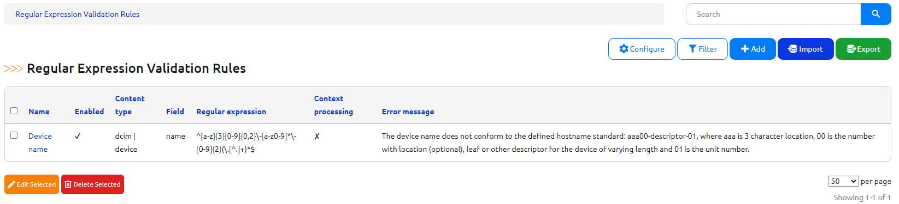
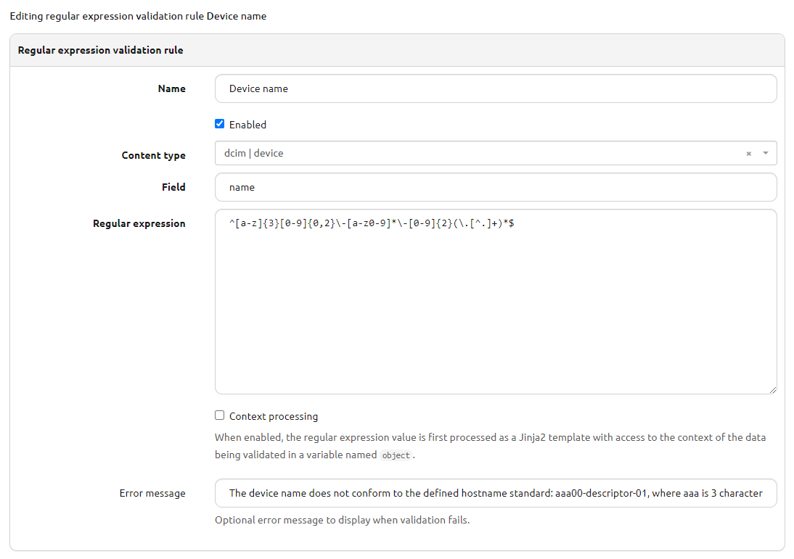
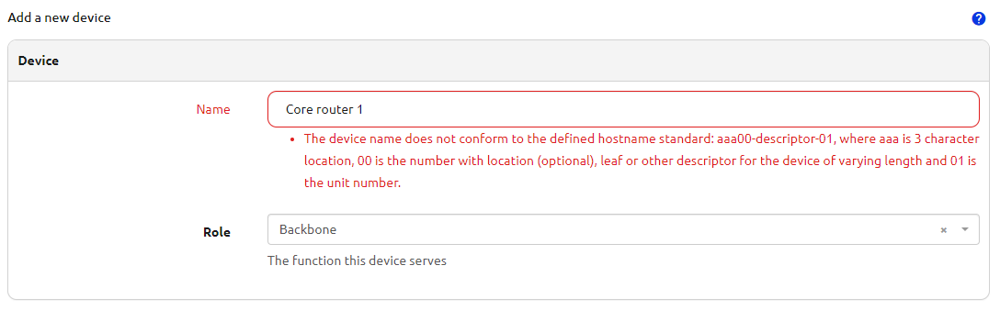

# Using the App

## General Usage

The data validation engine plugin offers a set of user definable rules which are used to enforce business constraints on the data in Nautobot. These rules are tied to particular models and each rule is meant to enforce one aspect of a business use case. There are currently two supported rule types, regular expressions, and min/max numeric rules.

## Use-cases and common workflows

### Regular Expression Rules

Each rule is defined with these fields:

* name - A unique name for the rule.
* enabled - A boolean to toggle enforcement of the rule on and off.
* content type - The Nautobot model to which the rule should apply (device, site, etc.).
* field - The name of the character based field on the model to which the regular expression is validated.
* regular expression - The body of the regular expression used for validation.
* error message - An optional error message to display to the use when validation fails. By default, a message indicating validation against the defined regular expression has failed is shown.

In this example, a device hostname validation rule has been created and prevents device records from being created or updated that do not conform to the naming standard.

### Min/Max Rules

Each rule is defined with these fields:

* name - A unique name for the rule.
* enabled - A boolean to toggle enforcement of the rule on and off.
* content type - The Nautobot model to which the rule should apply (device, site, etc.).
* field - The name of the numeric based field on the model to which the min/max value is validated.
* min - The min value to validate value against (greater than or equal).
* max - The max value to validate value against (less than or equal).
* error message - An optional error message to display to the use when validation fails. By default, a message indicating validation against the defined min/max value has failed is shown.

In this example, a max value for VLAN IDs has been configured, preventing VLANs greater than 3999 from being created.

